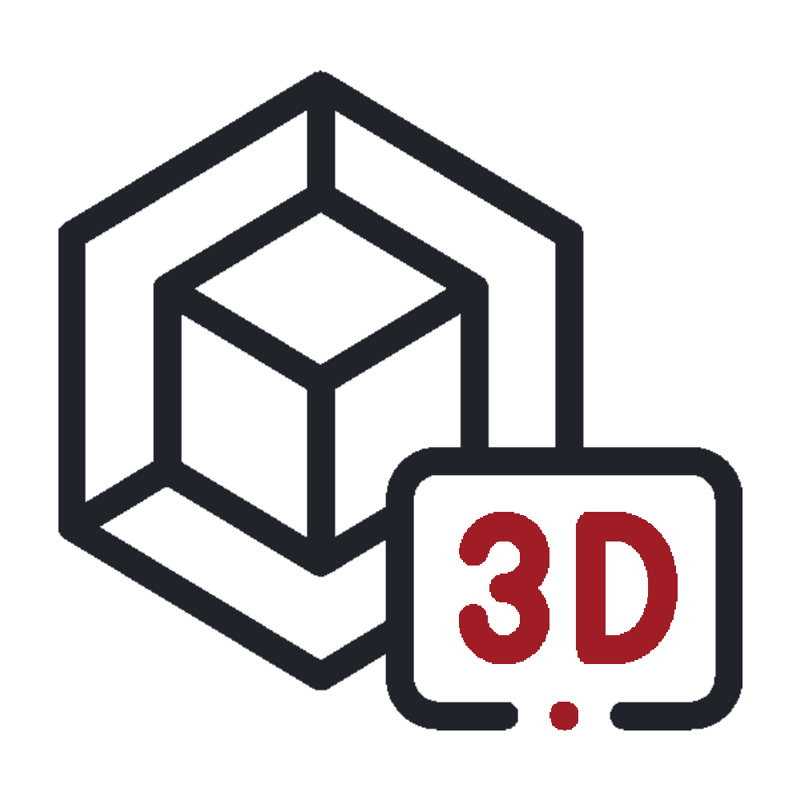
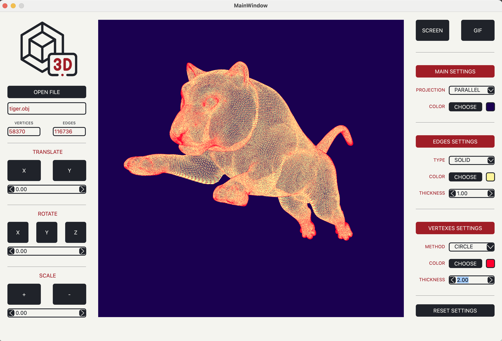
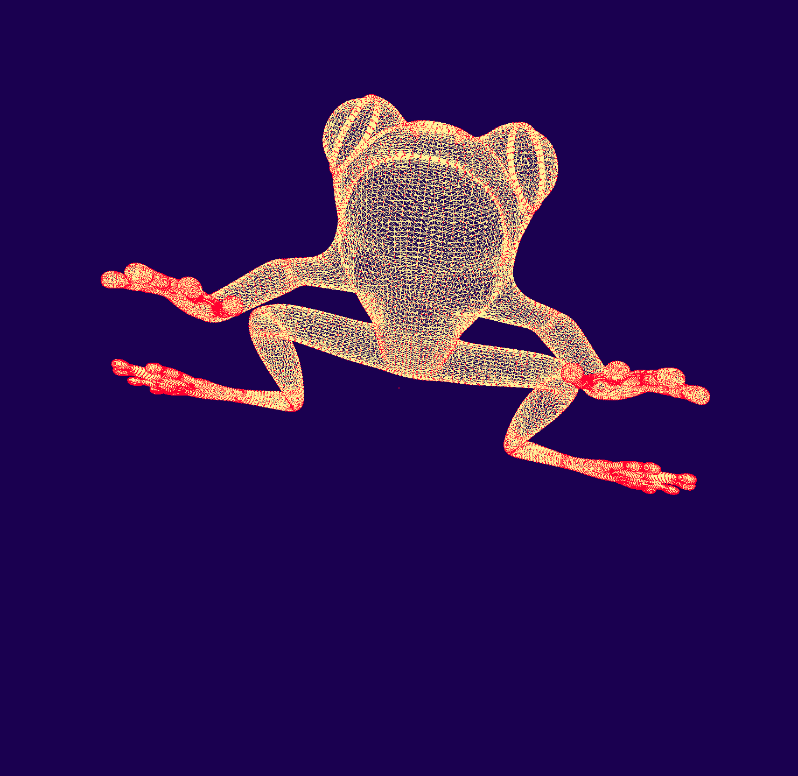

# **3DViewer** for macOS

## Описание программы
Программа позволяет открывать и просматривать файлы формата .obj, выполнять с объектом любые манипуляции, а также настраивать отображение объекта. 
Программа выполнена на языке программирования С++ с применеием ООП, архитектурных паттернов и паттернов программирования.

Объект можно вращать вокруг осей X, Y, Z, двигать по осям X, Y, отдалять и приближать.  
Перемещать и вращать объект можно как с помощью мыши, так и клавишами на левой панели приложения.  
Левая кнопка мыши отвечает за вращение объекта, правая - за перемещение, вращение колеса - за изменение масштаба.

********* 
## Реализация архитектуры программы

Общая архитектура программы построена на основе паттерна **MVC** (Model View Controller, реализация в одноименных директориях проекта).  

Также для оптимизации применены следующие паттерны программирования:

* Strategy
* Facade
* Singleton

Отрисовка объекта объекта выполняется на **OpenGL** с созданием и ипользованием **Шейдеров**

********* 
## Настройки

На правой панели приложения можно задать следующие настройки отображения объекта: 

<li>Выбор проекции: <b>центральная и параллельная</b></li>
<li>Цвет фона отображения модели</li>
<li>Тип линий: <b>пунктирная и сплошная</b></li>
<li>Цвет линий модели</li>
<li>Толщину линий модели</li>
<li>Тип вершин: <b>отсутствуют, круглые, квадратные</b></li>
<li>Цвет вершин модели</li>
<li>Размер вершин модели</li>

 
При закрытии приложения происходит сохранение всех существующих настроек в файл **settings.conf** в директории **Resources**.  
При открытии программы проводится сверка существующих (сохраненных) настроек со стандарными. Если между ними имеются различия, при откртии приложения выводится соответсвующее сообщение. 
Для сброса кастомных настроек и возвращения к стандартным необходимо нажать <b>Reset settings</b>

 
Реализация класса Settings представленна в одноименной директории проекта.

********* 

## Screenshot и Gif

Для создания скриншота модели можно нажать кнопку <b>Screen</b> и далее выбрать путь сохраниения <b>.png</b> изображения. 
По умолчанию скриншоты сохраняются в папку <b> Applications/3DViewer/Screenshots/</b> 
Для создания <b>GIF</b>-изображения можно нажать кнопку <b>Gif</b> и вращать/перемещать объект в течении 5 секунд.  
По завершению записи приложение выдаст сообщение о создании Gif-изображения и предложит сохранить файл.  
По умолчанию GIF-изображения сохраняются в папку <b> Applications/3DViewer/Gif/</b> 

********* 

## Makefile и Unit-тесты на матрицы
В корневой дирректории располоден Makefile со следующими целями:

* **make all** - выполняет цели **test, check, clean**
* **test** - запускает **Unit-тесты** на основе библиотеки GTest, проверку парсинга .obj файла, проверку результата афинных преобразований матрицы объекта по всем доступным вариантам модификации объекта.  Преобразование для тестов производится с посредством перемножения матрицы вершин объекта на соответсвующие афинные матрицы перехода. 
Для выполнения **Unit-тестов** реализована собственная библиотека **matrix.h** со всеми методами взаимодействия с матрицами
* check - запускает проверку всех файлов на стилевые нормы, утечки и **cppcheck**
* install - выполняет установку приложения в директорию **Applications/**
* uninstall - производит деинсталяцию приложения
* dist - архивирует дистрибутив программы в **.tar** файл
* dvi - запускает readme.html
* clean - выполняет полную очистку файлов установки и удаленние всех данных приложения
