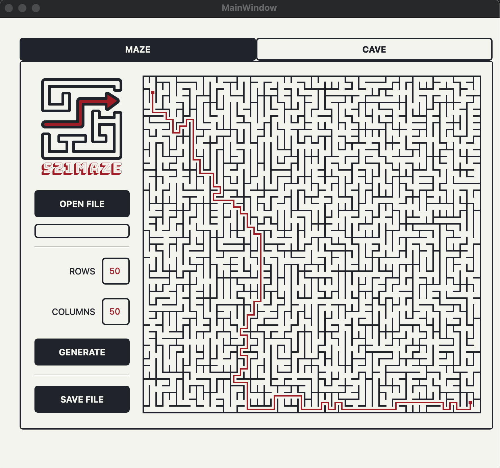
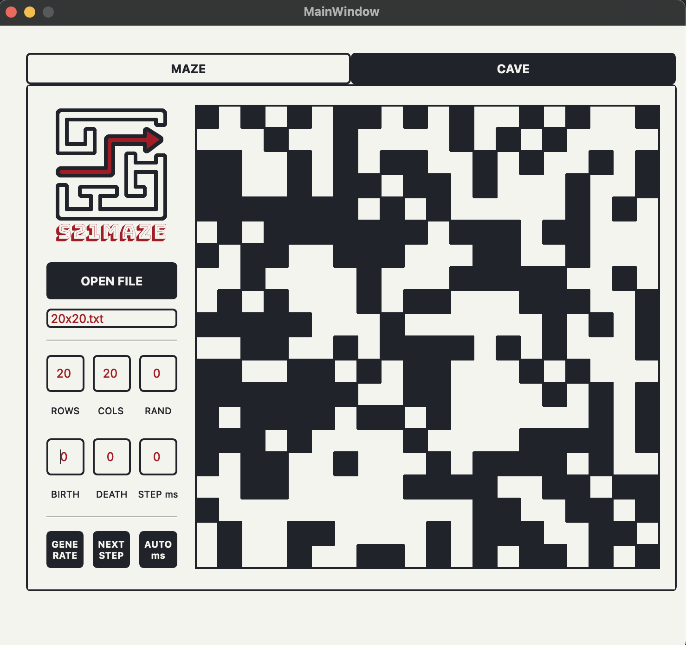

<p align="center">

</p>

# **Maze** for macOS

## Описание программы
Программа Maze, позволяет генерировать и отрисовывать идеальные лабиринты и пещеры. <br>
Программа выполнена на языке программирования С++ с применеием ООП, архитектурных паттернов и паттернов программирования.

********* 
## Реализация архитектуры программы

Общая архитектура программы построена на основе паттерна **MVC** (Model View Controller, реализация в одноименных директориях проекта).<br> 

Также для оптимизации применены следующие паттерны программирования:

* Strategy
* Facade
* Singleton

********* 
# Лабиринты
<p align="center">


</p>


Программа позволяет как открывать уже созданные лабиринты из *.txt* так и генерировать свои **"идеальные лабиринты"**.  <br>

```
Идеальным считается лабиринт, в котором из каждой точки можно попасть в любую другую точку ровно одним способом.
```
Для генерации *идеального лабиринта* реализован **Алгоритм Эйлера**<br>

Выстави размеры лабиринта (можно прокрутить колесом) и нажми кнопку *Generate*<br>
Максимальный размер лабиринта 50 х 50 ячеек. <br>

Лабиринты отрисовываются на экране в поле размером 500 x 500 пикселей. <br>

Чтобы сохранить лабиринт в .txt файл нажми *Save file* и выбери путь.
 
## Построение пути

В любом лабиринте можно найти один единственный путь от одной точки до другой.<br>

Программа реализовывает нахождение пути между двумя точками с помощью **Волнового алгоритма (алгоритм Ли)**<br>

Просто выбери две любые точки на поле лабиринта и программа построит путь между ними

<br>

********* 
# Пещеры
<p align="center">


</p>

В программе реализована возможность открывать из *.txt* файла и генерировать пещеры с использованием клеточного автомата<br>

```
В Пещерах правила проще, чем в "Жизни" - есть две специальные переменные, одна для "рождения" "мертвых" клеток (предел "рождения") и одна для уничтожения "живых" клеток (предел "смерти").
Если "живые" клетки окружены "живыми" клетками, количество которых меньше, чем предел "смерти", они "умирают".
Аналогично если "мертвые" клетки находятся рядом с "живыми", количество которых больше, чем предел "рождения", они становятся "живыми".
```

Для генерации пещеры пользователем задаются ее размеры и  шанс на начальную инициализацию клетки.<br>
Максимальный размер пещеры 50 х 50 ячеек. <br>

Для выполнения одного *шага* необходимо задають пределы "рождения" и "смерти" клетки<br>
Далее можно выполнять *шаги* нажатием кнопки *Next step* или можно задать *колличество шагов в секунду* и нажать *Auto*.

********* 

## Makefile и Unit-тесты на матрицы
В корневой дирректории расположен Makefile со следующими целями:

* **make all** - выполняет цели **test, check, clean**
* **test** - запускает **Unit-тесты** на основе библиотеки GTest, проверку парсинга .txt файла, проверку генерации файлов, проверку нахождения пути, шага в пещере.<br> * check - запускает проверку всех файлов на стилевые нормы, утечки и **cppcheck**
* install - выполняет установку приложения в директорию **Applications/**
* uninstall - производит деинсталяцию приложения
* dist - архивирует дистрибутив программы в **.tar** файл
* dvi - запускает readme.html
* clean - выполняет полную очистку файлов установки и удаленние всех данных приложения
