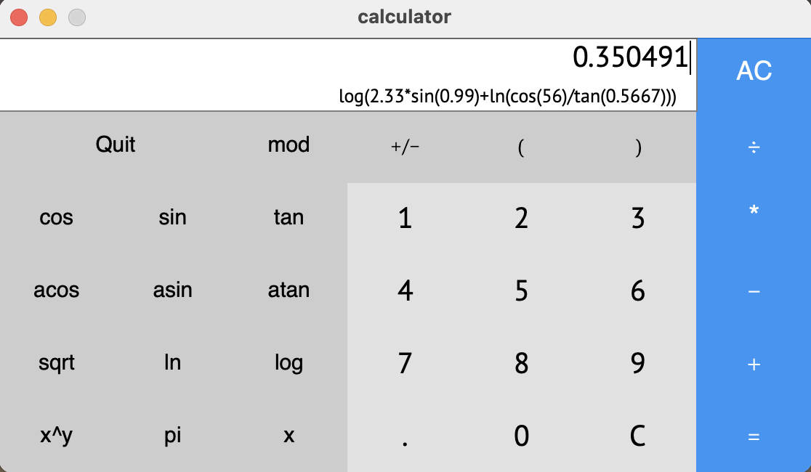
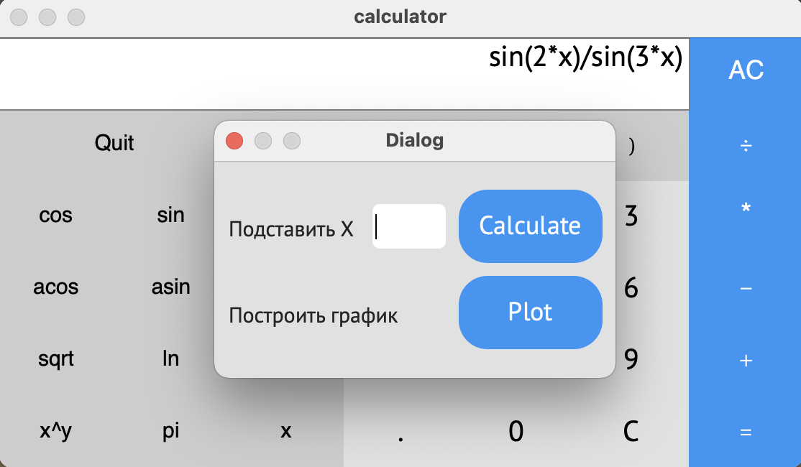
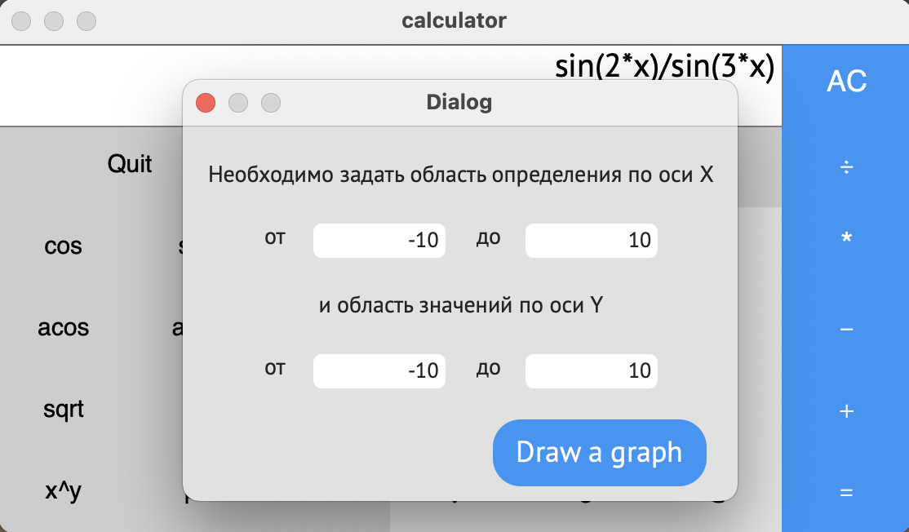
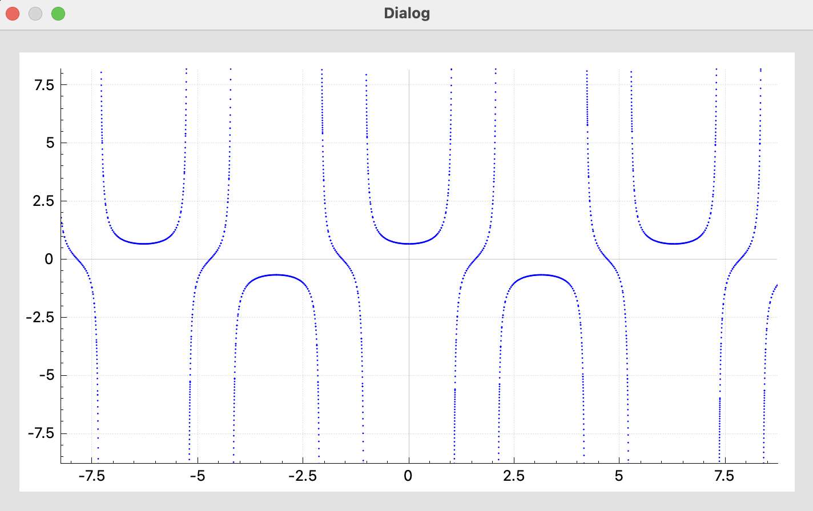

# **SmartCalc** for macOS

## General information

The program inplement an engineering version of calculator and have a simpe interface with input window and buttons
    (digits, operations, functions, etc.). 

The general architecture of the program is built on the basis of the **MVC** pattern (Model View Controller, implemented in the project directories of the same name). 
The engine of program works by <i>Dijkstra's algorithm</i> and every expresson translate into <i>Reverse Polish (bracketless) notation</i> and then calculate. 

Also SmartCalc builds graphs in new window with coordinate grid if input string has unknown variable (<b>x</b>).

********* 
## Operations

SmartCalc has ordinary operations with nambers, like <b>*, /, +, -, mod, pow</b>.  User can prioritize operations by using <b>(, )</b>. Also user can change sign of last input number by press button <b>+/-</b>. 
For delate last symbol use <b>C</b>, and fo clearing all input string use <b>AC</b>.

********* 
## Functions

 SmartCalc has opportunity to calculate some trigonometric functions, like <b>cos(x), sin(x), tan(x), acos(x), asin(x), atan(x), sqrt(x), ln(x), log(x)</b>. 

User can get a result with any number or can input unknown variable (<b>x</b>) and SmartCalc creates the graph of this function.

If User want to create a graph of function, the application will offer to set the scope of graph

User can transform the window of graph, zoom in and out it and move the graph with left button of mouse.

********* 

## Makefile и Unit-tests
The root directory contains a Makefile with the following targets:

* **make all** - run targets **clean, test**
* **test** - runs **Unit tests** based on the GTest library and tests the calculator against various complex equations
* check - starts checking all files for style norms, leaks and **cppcheck**
* install - installs the application to the **Applications/** directory
* dist - archives the distribution package of the program into a **.tar** file
* dvi - run Readme.md
* clean - used for running a command which clears out the project's build files and delete the app from **Applications/** directory
